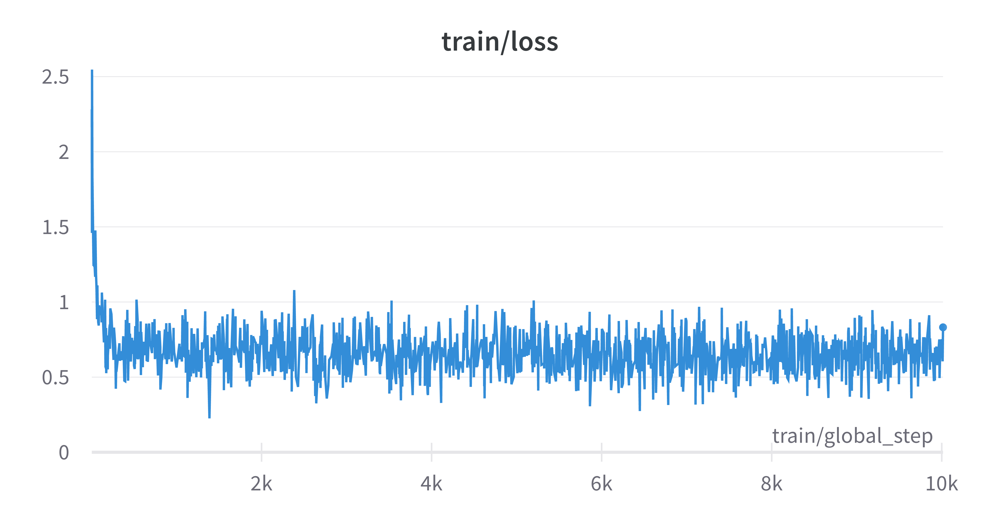
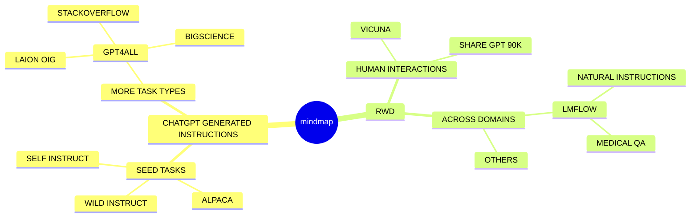

# Open-Instructions
A Pavilion of recent Open Source Generative Pre-trained Transformer (GPT) Projects for Decentralized AI.

## Overview

The recent surge in more efficient & open-source LLMs projects has been nothing short of fervent, yet the various instruction-finetuned [LLaMAs](https://arxiv.org/abs/2302.13971v1) have left those genuinely interested in customized GPT or even decentralized AI feeling puzzled. Consequently, we try to build this project that consolidates existing resources on either LLaMAs or any GPT variant. As 🤗huggingface and peft has extensively integrated mature pre-training and fine-tuning pipelines, the majority of these open-source models or chatbots are compatible with unified `Trainer` of transformers. The sole distinction lies in the **datasets for finetuning**. Therefore, our open-source initiative's paramount contribution lies in assisting the community with consolidating existing open-source *datasets of instructions*, which is amalgamated and named as `Open-Instructions` ([GoogleDrive](https://drive.google.com/drive/folders/1ayDrI51us10WhtNNZkJH3HTSIrMZrEG3?usp=share_link)). We evaluate their strengths and weaknesses, and would also release an open-source efficient model trained on **all of these data**, referred to as `Ailurus` which is my favorite animal.

Notes: In this project, we inherit most of the codes from [Vicuna](https://github.com/lm-sys/FastChat) for data cleaning, finetuning and serving, a big shout out to the team for their fantastic work!

## Contents
- [Open-Instructions Summary](#open-instructions-summary)
- [Ailurus (ours)](#ailurus-checkpoints)
- [Alpaca](#alpaca)
- [ColossalAI Chatbot (Coati)](#colossalai-chatbot)
- [GPT4LLM](#gpt4llm)
- [Vicuna](#vicuna)
- [GPT4ALL](#gpt4all)
- [LMFlow](#lmflow)
- [Dolly](#dolly)

## Open-Instructions Summary
Here is a short summary of different open-source datasets for instruction finetuning.

| Dataset    | Num of Samples (Lang) | Engine | Cost |
| -------- | ------- | ------- | -------|
| [Alpaca](https://github.com/tatsu-lab/stanford_alpaca)  | 52K En   | `text-davinci-003` | <$500 |
| [InstructionWild (Coati)](https://github.com/XueFuzhao/InstructionWild) | 52K En & 52K Zh | `text-davinci-003`| $880 |
| [ShareGPT-90K (Vicuna)](https://github.com/lm-sys/FastChat) | ~100K => 48K Multi-lingual | `gpt-3.5-turbo` | Scrapped(free?) |
| [GPT4ALL](https://github.com/nomic-ai/gpt4all) | ~806K => 437K Multi-lingual | `gpt-3.5-turbo` | $500 |
| [GPT4LLM](https://github.com/Instruction-Tuning-with-GPT-4/GPT-4-LLM) |  52K En & 52K Zh   | `gpt-4` | Est >$880 |
| [Dolly](https://github.com/databrickslabs/dolly) | ~15K En | `databricks employees` | n/a | 

## Ailurus Checkpoints
We aim to open source the entire training logs to receive feedback for improvements but it's still ongoing. We follow [Vicuna's](https://github.com/lm-sys/FastChat) data cleaning, training and inference pipeline to train Ailurus with [LoRA](https://github.com/microsoft/LoRA). As of now, we only release one checkpoint at [Google Drive](https://drive.google.com/drive/folders/1ayDrI51us10WhtNNZkJH3HTSIrMZrEG3?usp=share_link) as we observe the training kinda saturates at ~10k steps. But more is coming...Again, we are not distributing LLaMA weights.

### Current Development Plan

| Pipelines   |   Status |
|----------|:-------------:|
| Instruction Data Analysis |  :wrench: Developing  |
| Instruction Tuning |  :white_check_mark: Supported |
| Parameter-Efficient Tuning |  :white_check_mark: Supported |
| Large Model Inference |  :wrench: Developing  |
| UI Serving |  :wrench: Developing  |
| Alignment Tuning |  :wrench: Developing |

## Alpaca
[Stanford Alpaca](https://github.com/tatsu-lab/stanford_alpaca) is definitely the one representative open source lightGPT project that lits the fire. The dataset Alpaca was trained on contains `52K` instruction-following data generated by [Self-Instruct GPT](https://github.com/yizhongw/self-instruct). The JSON file `alpaca_data.json` in their repo is a list of dictionaries, each dictionary contains the following fields:

- `instruction`: `str`, describes the task the model should perform. Each of the `52K` instructions is unique.
- `input`: `str`, optional context or input for the task. For example, when the instruction is "Summarize the following article", the input is the article. Around `40%` of the examples have an input.
- `output`: `str`, the answer to the instruction as generated by `text-davinci-003`.

## ColossalAI Chatbot
[InstructionWild](https://github.com/XueFuzhao/InstructionWild) is the dataset ColossalaiChatbot [Coati](https://github.com/hpcaitech/ColossalAI/tree/main/applications/Chat) was trained on. It inherits the same format as [Alpaca](https://github.com/tatsu-lab/stanford_alpaca) for fast and easy usage. Differently, their instructions have no input field. The developers scrap over `700` noisy instructions from Twitter and filter out noisy instructions, subsequently pick `429` clean insturctions to ensure the high quality. They use a similar method as Alpaca to collect instructions. However, the generation does not need outputs for instructions thus avoid human involvement. The prompts generated are more diverse and covers more topics compared to the Alpaca's. They provide `5` prompts as examples for generating new instructions from OpenAI API. After collecting prompts, they collect responses of these instructions from OpenAI API. The English and Chinese datasets are generated seperately. In total, 880$ are spent to collect the dataset. There are `52K` instructions for English (around 24M tokens) and `52K` instructions for Chinese. 

## GPT4LLM
[GPT-4-LLM](https://github.com/Instruction-Tuning-with-GPT-4/GPT-4-LLM) follows exactly how Alpaca uses GPT to generate the instructions and further utilizes the latest `gpt-4` engine instead of `text-davinci-003` to generate `52K` instructions using the same prompts in Alpaca. Additionally, the developers also release `52K` instructions in Chinese.

## Vicuna
[Vicuna](https://github.com/lm-sys/FastChat) (not sure why everyone is so much into the camelid family..) is created by fine-tuning a LLaMA based model using approximately `70K` user-shared conversations gathered from [ShareGPT.com](https://sharegpt.com/) with public APIs. To ensure data quality, they convert the HTML back to markdown and filter out some inappropriate or low-quality samples. Additionally, they divide lengthy conversations into smaller segments that fit the model's maximum context length. For detailed instructions to clean the ShareGPT data, check out [here](https://github.com/lm-sys/FastChat/blob/main/docs/commands/data_cleaning.md). Unfortunately, the developers of Vicuna choose not to release the data at the moment. But our uncapped heros stand out and release the pre-cleaned version of [ShareGPT-90K](https://huggingface.co/datasets/anon8231489123/ShareGPT_Vicuna_unfiltered) (see discussions [here](https://github.com/lm-sys/FastChat/issues/90#issuecomment-1493250773)), which one may use Vicuna's [cleaning script](https://github.com/lm-sys/FastChat/blob/main/docs/commands/data_cleaning.md) to clean it manually.

## GPT4All
[GPT4ALL](https://github.com/nomic-ai/gpt4all) collected roughly `one million` promptresponse pairs using the GPT-3.5-Turbo OpenAI API between March 20, 2023 and March 26th, 2023. To do this, they first gathered a diverse sample of questions/prompts by leveraging three publicly available datasets:
- The unified chip2 subset of [LAION OIG](https://huggingface.co/datasets/laion/OIG)
- Coding questions with a random sub-sample of [Stackoverflow Questions](https://huggingface.co/datasets/pacovaldez/stackoverflow-questions)
- Instruction-tuning with a sub-sample of [Bigscience/P3](https://huggingface.co/bigscience/bloomz-p3) with dedicated substantial attention to data preparation and curation based on commentary in the Alpaca project. 

Upon collection of the initial dataset of promptgeneration pairs, they loaded data into [Atlas](https://atlas.nomic.ai/map/gpt4all_data_clean_without_p3) for data curation and cleaning. With Atlas, they further removed all examples where GPT-3.5-Turbo failed to respond to prompts and produced malformed output. This reduced our total number of examples to `806,199` high-quality prompt-generation pairs. Interestingly, the developers decided to remove the entire Bigscience/P3 subset from the final training dataset due to its *very low output diversity*; P3 contains many homogeneous prompts which produce short and homogeneous responses from GPT-3.5-Turbo. This exclusion produces a final subset containing `437,605` prompt-generation pairs. The datasets are available at:
- [Training Data Without P3](https://huggingface.co/datasets/nomic-ai/gpt4all_prompt_generations)
- [Full Dataset with P3](https://huggingface.co/datasets/nomic-ai/gpt4all_prompt_generations_with_p3)

## LMFlow
[LMFlow](https://github.com/OptimalScale/LMFlow/tree/main) is a recent open source tookit for finetuning and inference of LLMs. They release a [natural instructions dataset](https://github.com/OptimalScale/LMFlow/blob/main/data/download.sh) but unfortunately without detailed descriptions of how they collected. Additionally, they also reformat three public Medical-QA related datasets known as `PubMedQA(ID)`, `MedMCQA(ID)`, `MedQA-USMLE (OOD)` for domain-specific finetuned LLaMA, which also achieves a feasible performance compared to chatGPT.

## Dolly
Databricks’ [Dolly](https://github.com/databrickslabs/dolly) is an instruction-following large language model trained on the Databricks machine learning platform that is licensed for **commercial use**. Based on `pythia-12b`, Dolly is trained on `~15K` instruction/response fine tuning records generated by `Databricks employees` in capability domains from the InstructGPT paper, including brainstorming, classification, closed QA, generation, information extraction, open QA and summarization. dolly-v2-12b is not a state-of-the-art model, but does exhibit surprisingly high quality instruction following behavior not characteristic of the foundation model on which it is based.

The model is available on Hugging Face as [databricks/dolly-v2-12b](https://huggingface.co/databricks/dolly-v2-12b).

### Pros

- Our new dataset improves the model's ability in  **Generation, Open QA, and Mind Storm instructions**. This corresponds to our data collection process. Our data is collected from Twitter, where users tend to share their interesting prompts of mostly generation, open QA, and mind-storm types.

### Limitations for LLaMA-finetuned models

- Both Alpaca and ColossalChat are based on LLaMA. It is hard to compensate for the missing knowledge in the pre-training stage.
- Lack of counting ability: Cannot count the number of items in a list.
- Lack of Logics (reasoning and calculation)
- Tend to repeat the last sentence (fail to produce the end token).
- Poor multilingual results: LLaMA is mainly trained on English datasets (Generation performs better than QA).

### Limitations of dataset

- Lack of summarization ability: No such instructions in finetune datasets.
- Lack of multi-turn chat and role-playing: No such instructions in finetune datasets
- Lack of self-recognition: No such instructions in finetune datasets
- Lack of Safety:
    - When the input contains fake facts, the model makes up false facts and explanations.
    - Cannot abide by OpenAI's policy: When generating prompts from OpenAI API, it always abides by its policy. So no violation case is in the datasets.

## A Preliminary Mindmap

